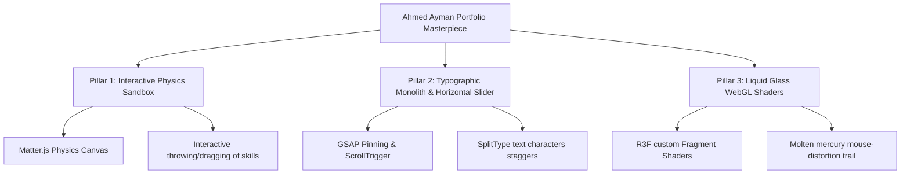

# Masterpiece Plan: Elite Creative-Engineer Portfolio Overhaul
Inspired by sumanthsamala.com, tanmayagrawal.dev, juanmora.co, jackwatkins.co, and fluid.glass

## 🎯 The Vision: Bridging AI Engineering & Immersive Creative Design

Ahmed Ayman is not a standard developer; he is a **full-stack AI engineer with a designer's eye**. A boring Tailwind resume layout is a P0 failure. We are rebuilding this portfolio as an **interactive, out-of-this-world visual experience** that matches the high-end designer sites on Awwwards, utilizing your background to make the website itself prove your AI and engineering superpowers.

---

## 🎨 Masterpiece Visual Pillars

### 1. Pillar 1: The "Interactive 2D Physics Skills Sandbox" (Inspired by magic5.ro)
- **Concept:** In the Skills fold, we discard all static text grids. Instead, we build an **interactive drag-and-throw 2D physics sandbox** using **Matter.js**.
- **Visuals:** Frosted glass capsule badges (glowing borders, crisp text: "PyTorch", "Next.js", "Gemini", "Transformers") float inside a bounded container.
- **Interactivity:** Visitors can grab, toss, and bounce these capsules against the container walls and each other using the mouse pointer! Bouncing a capsule triggers a micro-glow spark.

### 2. Pillar 2: The "Typographic Monolith & Horizontal GSAP Scroll Slider" (Inspired by juanmora.co & jackwatkins.co)
- **Concept:** We implement a cinematic editorial layout.
- **Hero Fold:** Replaced by one single, massive typographic line: **"ENGINEERING DYNAMIC INTELLIGENCE."** using custom wide headers (`Clash Display` style) in all-caps, with individual characters staggering up from invisible masks using GSAP.
- **Horizontal Works:** When scrolling to the Projects section, the page **pins (freezes)** vertical scroll, and horizontal slides (containing high-definition project mockups) slide horizontally with massive letter staggers and high-contrast liquid depth overlays.

### 3. Pillar 3: "Molten Liquid Glass Shader Canvas" (Inspired by fluid.glass & mina-massoud.com)
- **Concept:** Rebuild the background of the Hero section as a **flowing WebGL liquid glass / mercury shader field** using a custom GLSL fragment shader in React Three Fiber.
- **Visuals:** The canvas behaves like liquid glass or molten mercury. As the mouse pointer moves, it creates high-contrast mathematical displacement ripples that distort the underlying spatial coordinate mesh.

---

## 🛠️ Recommended Libraries & Styling (No-Cost Stack)
To execute this visual overhaul, we will introduce:
- **`matter-js`**: High-performance 2D rigid body physics engine.
- **`split-type`**: For character-by-character typography reveals.
- **Fontshare Typography (Natively configured):**
  - Header: **Clash Display** or **Syne** (Google Fonts) for massive geometric headers.
  - Body: **Satoshi** or **Plus Jakarta Sans** (Google Fonts) for clean UI text.

---

## 🗺️ Execution Phases for Claude CLI to Coordinate

### Phase 1: Premium Typography, Layout & Matte Theme
- **Directive:** Refactor the CSS theme in `globals.css` and `layout.js` to establish an **absolute premium dark architectural look**:
  - Background: Deep carbon black `#030305`.
  - Accent: High-luminance mercury white `#f3f4f6` and micro-accent electric cyan `#00f0ff` used sparingly.
  - Borders: Thin `1px` lines at `rgba(255,255,255,0.03)` with sharp visual angles.

### Phase 2: React Three Fiber Custom GLSL Liquid Glass Shader
- **Directive:** Refactor `HeroCanvas.jsx` to render a single custom Mesh with a custom `ShaderMaterial`.
- **GLSL Shaders:** Implement custom Fragment/Vertex shaders computing liquid displacement vectors (Simplex noise fields) that ripple elastically with mouse moves, creating a fluid, mercury-like visual trail.

### Phase 3: Matter.js Interactive Skills Physics Sandbox
- **Directive:** Replace `Skills.js` with a custom Matter.js physics engine container:
  - Create rigid-body capsules with absolute text bounding boxes representing your skills.
  - Add mouse constraints enabling interactive throwing, dragging, and collisions.
  - Apply spring damping to cards to make their interactions feel extremely satisfying.

### Phase 4: Horizontal Projects Slider with Pinned ScrollTriggers
- **Directive:** Refactor `Projects.js` to pin the screen using GSAP `ScrollTrigger` and animate horizontal project panels sliding in from the right.
- **Typography Reveals:** Wire `SplitType` / GSAP text staggers to reveal project titles letter-by-letter on horizontal viewport entrance.
